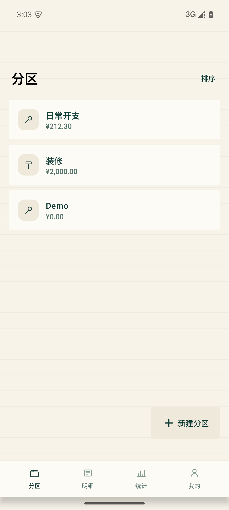
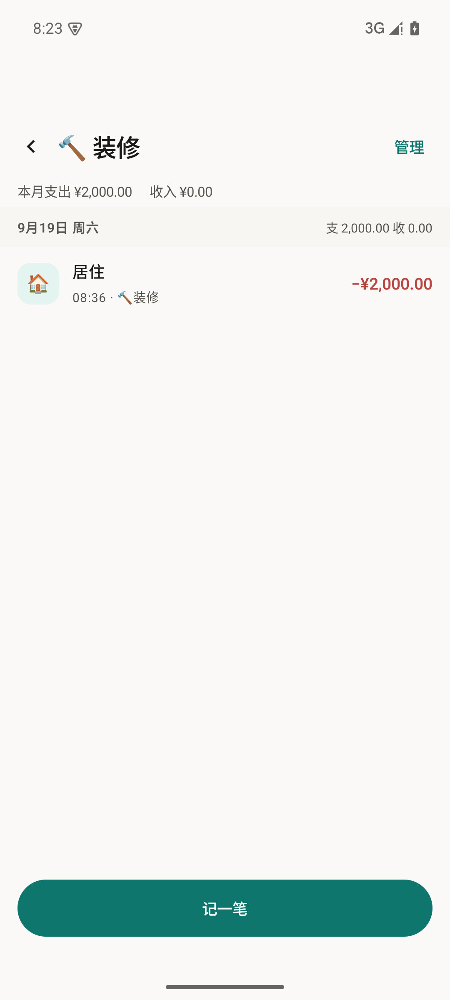
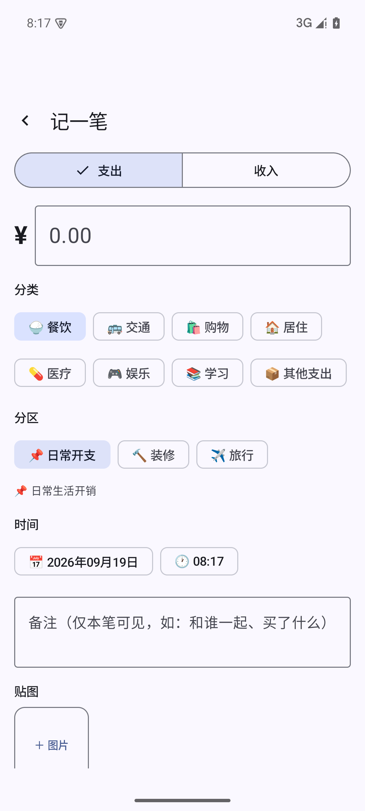
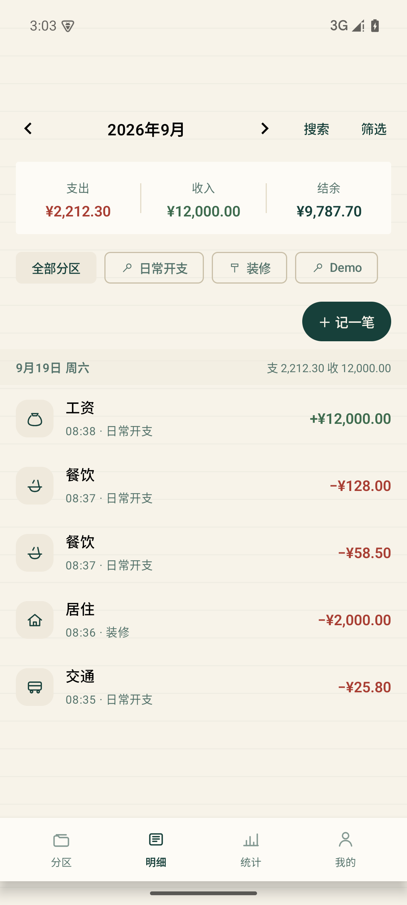
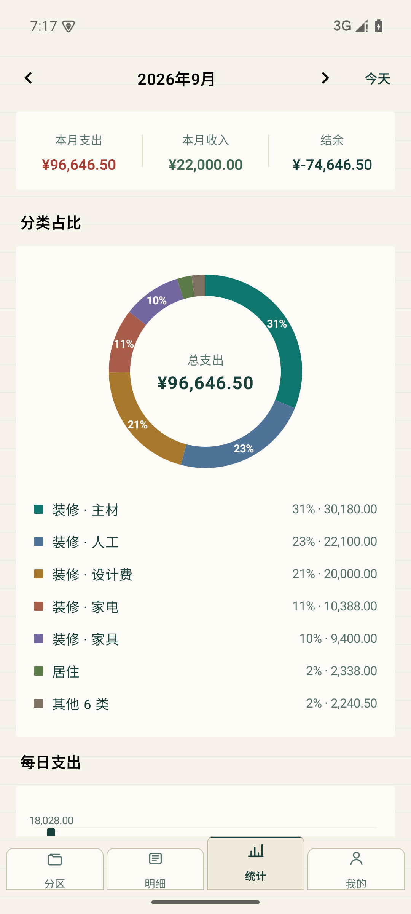
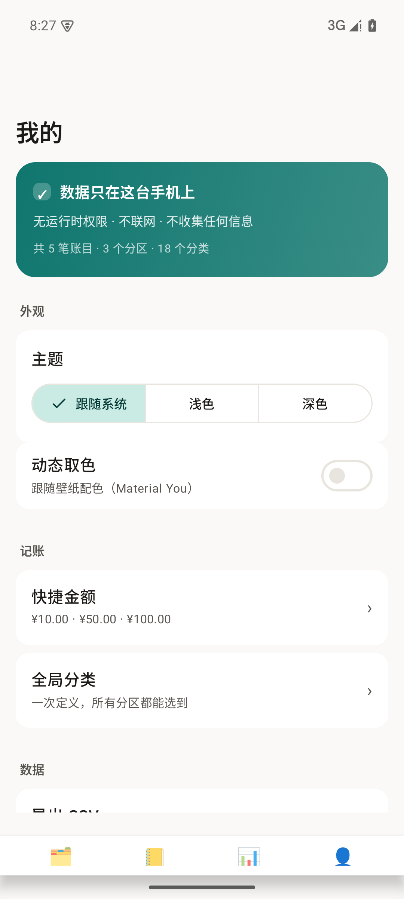
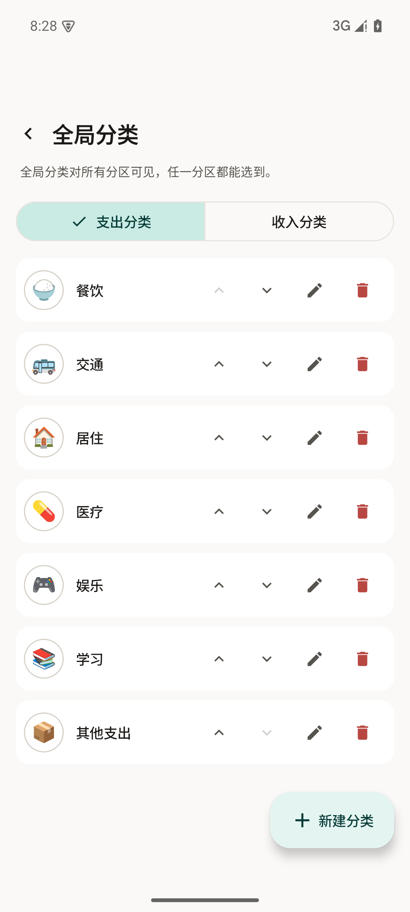
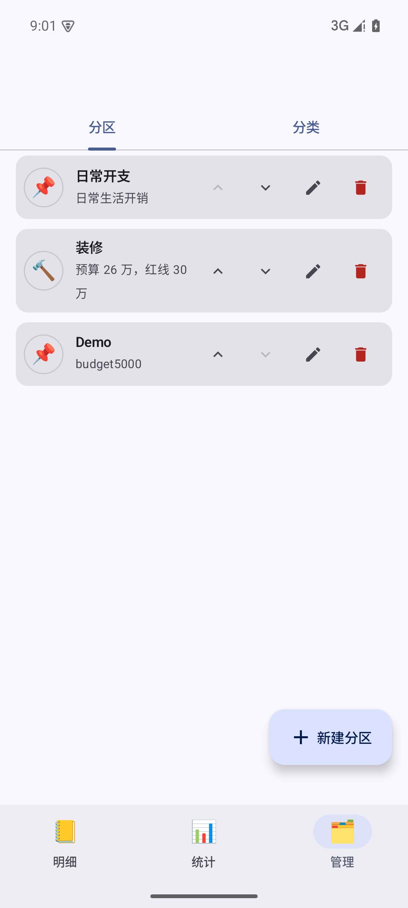
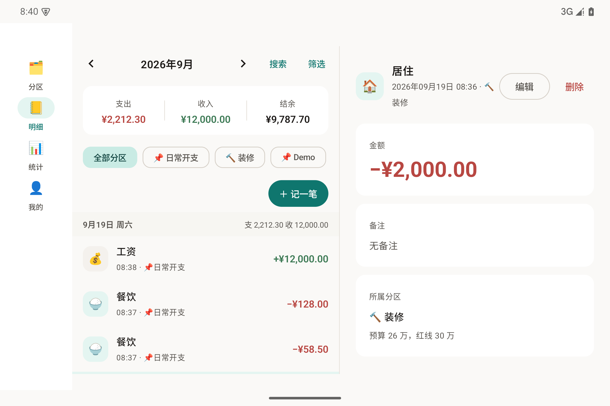

# 简账 SimpleLedger

原生 Android 记账应用。Kotlin + Jetpack Compose + Room，目标 Android 17（API 37），**无运行时权限、完全离线、数据不出设备**。

## 功能

- **分区优先**：分区是账目的一级归属，也是首屏（默认落点）。每个分区支持独立的**分区备注**与**月度预算**，首屏卡片直接给出本月花销与进度条、超支预警
- **自定义分类（含归属）**：分类分**全局分类**（一次定义、所有分区可用）与**分区专属分类**（仅该分区可见）；名称 + 手绘图标（内置图标集）+ 分组内排序。删除分类 / 分区时账目自动迁移到兜底目标，不丢账
- **记一笔**：金额、分类、**分区（上下文，记账时只读）**、**日期时间**（可改过去任意时间）、**单独备注**、**多张贴图**（系统相册选择，自动压缩存入应用私有目录）。保存后提示「已记入 …」并支持**撤销**；「保存并再记」保留分区 / 类型 / 时间连续记账
- **自动统计**：本月支出 / 收入 / 结余总览，分区占比环形图（点扇区联动该分区的分类构成，小扇区引出线标注），分类金额条形图（专属分类带分区名消歧），每日支出柱状图（峰值标注）
- **时间管理**：明细页按天分组展示每日小计，支持月份切换、关键词**搜索**（备注 / 分类 / 分区 / 金额）与筛选（分区 / 类型 / 分类 / **核对** / **报销** 状态，符号约定：✓ 已核对 · ○ 待报销 · ● 已报销），空态可直接清除筛选或去「分区」记账
- **我的**：数据导出 CSV、完整备份与恢复（含全部贴图）、全局分类管理入口、主题（跟随系统 / 浅色 / 深色）与动态取色、快捷金额档位、隐藏金额、应用锁与截屏保护
- **多端适配**：手机（底部**四槽位**导航：分区 · 明细 · 统计 · 我的）· 折叠屏 / 平板（Navigation Rail）· 大屏（列表–详情双栏）
- 隐私优先：无运行时权限（`USE_BIOMETRIC` 为 normal 权限、安装即授予、不弹框），无网络，无追踪；可选**应用锁**（指纹 / 锁屏密码）与**截屏保护**（`FLAG_SECURE`）；数据跟随系统备份（云备份 / 换机迁移）

## 界面预览

> 视觉方向为「手账风格 v2.1」：纸墨质感、和纸胶带分区色、楷体点缀、等宽数字、3/1/6/4/8 圆角体系。
> 设计规范唯一真源见 [`docs/design/journal-style-spec-2026-09-20.md`](docs/design/journal-style-spec-2026-09-20.md)；机器可读令牌 [`tokens-journal.json`](docs/design/tokens-journal.json)、图标生成链 [`icons-v3/`](docs/design/icons-v3/)。

**「分区优先」主流程**（手机 · 底部四槽导航：分区 · 明细 · 统计 · 我的）

| 分区首屏（卡片 · 预算进度） | 分区详情（按天分组 · 记一笔） | 记一笔（分区只读 · 分类分组） |
|---|---|---|
|  |  |  |

| 明细（跨分区流水 · 分区筛选） | 统计（占比 · 趋势） | 我的（隐私承诺 · 导出与备份） |
|---|---|---|
|  |  |  |

**管理面与大屏**

| 全局分类管理 | 分区管理（专属分类 · 排序） | 大屏双栏（≥840dp） |
|---|---|---|
|  |  |  |

## 技术栈

| 维度 | 选型 |
|---|---|
| 语言 / UI | Kotlin 2.4 + Jetpack Compose（Material 3，支持 Material You 动态取色） |
| 字体 / 图标 | 内嵌 LXGW WenKai（楷体点缀位）· 自绘手账图标集（`docs/design/icons-v3/` 生成链产出，勿手改工程内图标文件） |
| 构建 | AGP 9.4.0（内置 Kotlin）+ Gradle 9.7.1 + KSP 2.3.12 |
| 目标平台 | compileSdk / targetSdk **37**（Android 17），minSdk 26（Android 8.0） |
| 数据库 | Room 2.8.5（金额以「分」为单位的 Long 存储，避免浮点误差） |
| 图片 | Coil 3 + 系统照片选择器（Photo Picker，无需存储权限） |
| 架构 | 单模块三层：UI（Compose + ViewModel）→ Repository → Room DAO |
| 测试 / CI | JUnit 单元测试（金额解析、统计逻辑）+ GitHub Actions 自动构建 APK |

## 构建

```bash
./gradlew assembleDebug        # 调试包：app/build/outputs/apk/debug/app-debug.apk
./gradlew assembleRelease      # 发布包：app/build/outputs/apk/release/app-release.apk
./gradlew testDebugUnitTest    # 单元测试（金额解析 / 统计逻辑）
```

要求：JDK 17+，Android SDK Platform 37。也可以直接从 GitHub Actions 下载每次构建的 APK。

发布签名（可选）：在仓库根目录放 `keystore.properties`（`storeFile` / `storePassword` / `keyAlias` / `keyPassword`）指向签名证书；**缺失时自动退回 debug 签名**，本地调试不受影响。正式版 APK 按约定固化到 [`dist/`](dist/)（如 `SimpleLedger-v1.2.1-release.apk`）并打同名 tag 发布。

## 项目结构

```
app/src/main/java/com/simpleledger/app/
├── MainActivity.kt / LedgerApp.kt
├── di/AppContainer.kt              # 手工依赖注入
├── data/
│   ├── local/entity/Entities.kt     # 分区 / 分类 / 账目 / 贴图
│   ├── local/dao/                   # EntryDao（含统计聚合 SQL）/ SectionDao / CategoryDao
│   ├── local/AppDatabase.kt         # 建库 + 迁移（v2 预算字段）+ 预置默认分区分类
│   ├── repo/                        # LedgerRepository / ImageStorage
│   ├── export/                      # DataExporter：CSV 导出 / 完整备份与恢复
│   └── settings/                    # AppSettings：主题 / 隐藏金额 / 快捷金额等偏好
├── logic/                           # 纯 Kotlin 逻辑：统计 / 预算比例 / 分类候选（可单测）
├── util/                            # 金额与时间格式化（Formatters.kt）
└── ui/
    ├── Routes.kt                    # 路由契约（唯一真源）
    ├── theme/                       # 设计令牌：纸墨色彩 / 3-1-6-4-8 圆角 / 楷体点缀位
    ├── icon/                        # SlIcons 手账图标集（生成产物，勿手改）
    ├── section/                     # 分区首屏 / 分区详情 / 分区管理 / 分区选择器
    ├── category/                    # 全局分类管理
    ├── ledger/                      # 明细页（按天分组 + 筛选 + 搜索）
    ├── entry/                       # 记一笔 / 编辑（分区只读、贴图、时间选择器）
    ├── stats/                       # 统计页（占比环图 / 柱状图 / 条形图）
    ├── mine/                        # 我的（导出 / 备份 / 全局分类入口 / 主题与隐私）
    ├── security/                    # 应用锁（BiometricPrompt 闸门）
    └── components/                  # 通用组件、图表与分区/分类管理共享组件
```

## License

私有项目，暂未开源授权。
