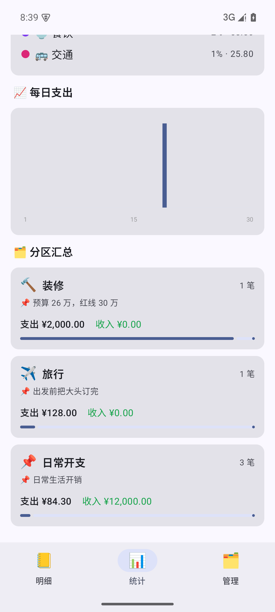
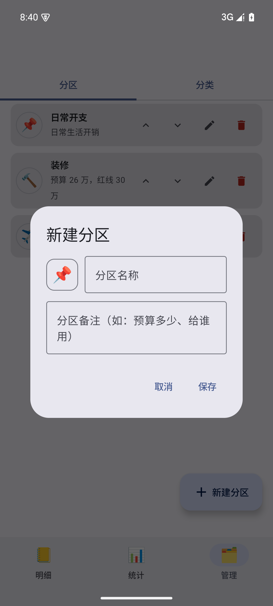

# 简账 SimpleLedger

原生 Android 记账应用。Kotlin + Jetpack Compose + Room，目标 Android 17（API 37），**无需任何权限、完全离线、数据不出设备**。

## 功能

- **分区管理**：账目按分区（如「日常开支」「装修」「旅行」）归类，每个分区支持独立的**分区备注**（可写预算、用途说明）
- **自定义分类**：支出 / 收入类型完全自定义（名称 + emoji 图标 + 排序），删除分类时账目自动迁移到兜底分类
- **记一笔**：金额、分类、分区、**日期时间**（可改过去任意时间）、**单独备注**、**多张贴图**（系统相册选择，自动压缩存入应用私有目录）
- **自动统计**：本月支出 / 收入 / 结余总览，分类占比环形图，每日支出柱状图，**分区汇总**（含分区备注与占比进度条）
- **时间管理**：明细按天分组展示每日小计，支持月份切换、按分区 / 分类 / 类型筛选
- 隐私优先：0 权限申请，无网络，无追踪；数据跟随系统备份（云备份 / 换机迁移）

## 界面预览

| 明细（按天分组 + 筛选） | 记一笔（贴图 / 备注 / 时间） |
|---|---|
|  |  |

| 统计（占比环形图） | 分区汇总（含分区备注） |
|---|---|
|  |  |

| 分区管理 | 新建分区（emoji + 备注） |
|---|---|
|  |  |

## 技术栈

| 维度 | 选型 |
|---|---|
| 语言 / UI | Kotlin 2.x + Jetpack Compose（Material 3，支持 Material You 动态取色） |
| 构建 | AGP 9.4.0（内置 Kotlin）+ Gradle 9.7.1 + KSP 2.3.12 |
| 目标平台 | compileSdk / targetSdk **37**（Android 17），minSdk 26（Android 8.0） |
| 数据库 | Room 2.8.5（金额以「分」为单位的 Long 存储，避免浮点误差） |
| 图片 | Coil 3 + 系统照片选择器（Photo Picker，无需存储权限） |
| 架构 | 单模块三层：UI（Compose + ViewModel）→ Repository → Room DAO |
| 测试 / CI | JUnit 单元测试（金额解析、统计逻辑）+ GitHub Actions 自动构建 APK |

## 构建

```bash
./gradlew assembleDebug
# 产物：app/build/outputs/apk/debug/app-debug.apk
```

要求：JDK 17+，Android SDK Platform 37。也可以直接从 GitHub Actions 下载每次构建的 APK。

## 项目结构

```
app/src/main/java/com/simpleledger/app/
├── MainActivity.kt / LedgerApp.kt
├── di/AppContainer.kt              # 手工依赖注入
├── data/
│   ├── local/entity/Entities.kt     # 分区 / 分类 / 账目 / 贴图
│   ├── local/dao/                   # EntryDao（含统计聚合 SQL）/ SectionDao / CategoryDao
│   ├── local/AppDatabase.kt         # 建库 + 预置默认分区分类
│   └── repo/                        # LedgerRepository / ImageStorage
├── logic/StatsCalculator.kt         # 纯 Kotlin 统计逻辑（可单测）
├── util/                            # 金额与时间格式化、emoji 词表
└── ui/
    ├── ledger/                      # 明细页（按天分组 + 筛选）
    ├── entry/                       # 记一笔 / 编辑（贴图、时间选择器）
    ├── stats/                       # 统计页（饼图 / 柱状图 / 分区汇总）
    ├── manage/                      # 分区 / 分类管理
    └── components/                  # 通用组件与图表
```

## License

私有项目，暂未开源授权。
