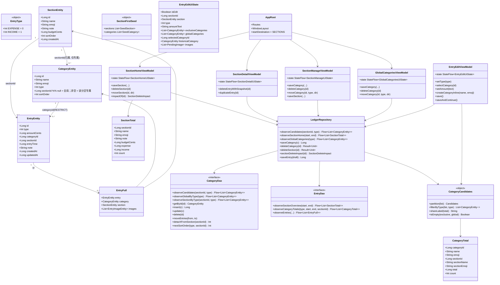
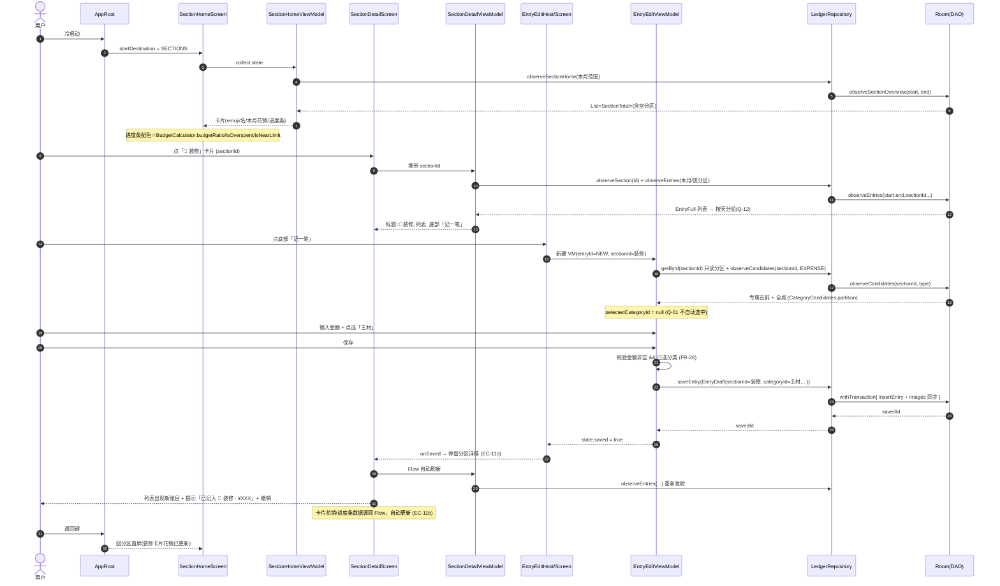
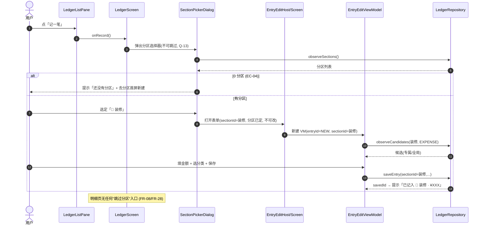
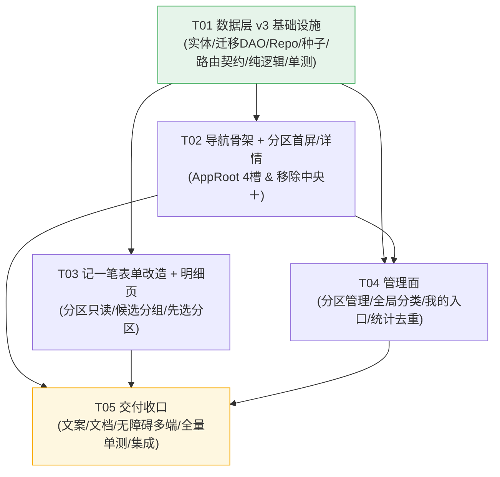

# SimpleLedger 增量系统设计：分区优先（Section-First）重构

| 项目 | 内容 |
|---|---|
| 文档类型 | **增量系统设计 + 任务分解**（只覆盖本次变更） |
| 产品 | SimpleLedger（简账）· 原生 Android · Kotlin + Jetpack Compose + Room |
| 基线 | 代码提交 `d7b155e`；DB `version = 2` |
| 目标 | DB `version = 3`；导航 5→4 槽、分区升首屏、分类引入归属维度 |
| 输入 | `docs/prd/section-first-2026-09-20.md`（含第 10 节全部裁定、第 11 节 8 项同步点） |
| 撰写 | 高见远（架构师） |
| 文档版本 / 日期 | v1.0 / 2026-09-20 |
| Language | 中文 |

> **本设计不重开第 10 节已定案裁定**。Q-01~Q-15 一律视为确定输入，本文只讨论"如何落地"。
> 真实包名为 `com.simpleledger.app`（不是 `com.simpleledger`），下文全部按真实路径书写。

---

# Part A：系统设计

## 1. 实现思路

### 1.1 核心难点

| # | 难点 | 说明 | 对策 |
|---|---|---|---|
| D-1 | **分类新增"归属"维度且不能破坏既有 FK** | `categories` 与 `entries` 之间是 `ForeignKey.RESTRICT`。SQLite **无法**给已有表 `ADD CONSTRAINT`；一旦要加 FK 就必须重建表——而重建 `categories` 会因 `entries` 的 RESTRICT 引用而失败 | 只在 `categories` 上做**纯增量 DDL**：`ADD COLUMN sectionId INTEGER`（可空，`NULL=全局`）+ 建索引。**故意不给 `sectionId` 声明 FK**，完整性改由 Repository 保证；`MIGRATION_2_3` 一句 DROP/CREATE TABLE 都不写 |
| D-2 | **既有 12 个分类的归属重排（D13）** | 库内为测试数据、用户尚未真正使用；但既不能删分类（RESTRICT），也不想留歧义 | 采用 **"改归属 + 补分类"**：12 个既有分类归位为**显式全局**（`sectionId = NULL`，`ADD COLUMN` 后天然为 NULL，零 UPDATE）；**新增** 装修专属分类；再把装修分区内语义冲突的账目 **UPDATE 重定向**到新专属分类（不动表结构） |
| D-3 | **分区删到 0（Q-06）+ 账目不丢（FR-40）+ 不重建表** | 三者需同时成立。`entries.sectionId` 为 `NOT NULL + RESTRICT`，理论上"最后一个分区有账目"时无法既删分区又不孤儿账目 | **删分区时把账目迁到"排序最靠前的其余分区"**；仅当**它是最后一个分区**时：若其**有账目则阻塞删除并给可读原因**，若其**无账目则允许删到 0**。这与 EC-04「0 分区时明细页历史账目为空」自洽，且不违反任何 FK / 不重建表 |
| D-4 | **删除专属分类时账目兜底（EC-03 / Q-05）** | 允许"某类型全局分类为 0"，但被删分类若有账目必须落到**同类型**有效分类 | 兜底链：①同类型·同分区其余专属 → ②同类型全局其余 → ③同类型任意其余（跨分区，允许，因历史显示不受可见性影响）。三级都空且**有账目**时才拒绝并给可读原因 |
| D-5 | **记一笔表单从"每次选分区"改为"分区即上下文"** | 三种宿主（全屏 / 居中浮层 / 右侧面板）共用同一 `EntryEditForm`，改造须一次到位、行为一致 | `EntryEditViewModel` 接收**固定 `sectionId`**；表单删除分区 chips、改为只读行；分类候选按 `(section, type)` 查询并分组 |
| D-6 | **历史账目引用"非候选分类"（EC-09）** | 删/改分类后老账不能空白、不能静默改写 | 显示层（列表/详情/统计/导出）一律走 `LEFT JOIN categories`，**不受归属可见性影响**；编辑态把"不在候选内的当前分类"作为**独立"历史分类"chip** 呈现并保留 |

### 1.2 技术选型（无新增框架）

| 维度 | 选型 | 理由 |
|---|---|---|
| 数据库 | **Room 2.8.5 + KSP**（沿用） | 既有栈；仅 `version 2→3` + 一个 `Migration` |
| 迁移 | `Migration(2, 3)` + `MigrationSql` 常量 | 沿用既有"SQL 文本抽常量、JVM 单测钉死"的工程约定（见 `MigrationSqlTest`） |
| 架构 | 单模块三层：Compose + ViewModel → Repository → DAO（沿用） | 不引入 DI 框架，继续手写 `AppContainer` |
| 纯逻辑 | 新增 `logic/CategoryCandidates`（无 Android 依赖） | 把"候选分组/排序/占比标签"抽成纯函数，**唯一能在 JVM 单测锁住查询口径**的手段（真实 SQL 依赖 Android） |
| 状态 | `StateFlow` + `combine` / `flatMapLatest`（沿用） | 与既有 ViewModel 完全一致 |

### 1.3 架构模式

MVP（Compose + ViewModel + Repository）不变。本次新增页面（分区首屏 / 分区详情 / 分区管理 / 全局分类管理）复刻既有页面范式：`Screen`（几何避让 + 形态分派）+ `ViewModel`（Flow 聚合）+ 复用 `ui/components`。

---

## 2. 文件清单

> 路径均相对 `app/src/main/java/com/simpleledger/app/`（测试在 `app/src/test/java/com/simpleledger/app/`）。

### 2.1 新增文件

| # | 相对路径 | 职责 |
|---|---|---|
| N1 | `ui/Routes.kt` | **路由契约**（从 `AppRoot.kt` 抽出并扩展）：`SECTIONS / SECTION_DETAIL / SECTION_MANAGE / GLOBAL_CATEGORIES / LEDGER / STATS / MINE / ENTRY_EDIT`，含 `entryEdit(entryId, sectionId)` 与 `sectionDetail(id)`、`sectionManage(id)` 等构造器。抽成独立文件的目的：让 T02/T03/T04 **可并行**，都只依赖 T01 |
| N2 | `logic/CategoryCandidates.kt` | 纯函数：候选分类**排序+分组**（专属在前/全局在后）、按类型拆分、占比标签拼接（Q-09 消歧）、空态判定（EC-05）。**无 Android 依赖，可 JVM 单测** |
| N3 | `data/local/SectionFirstSeed.kt` | **纯 Kotlin** 示例数据结构（分区 / 全局分类 / 分区专属分类），供 `seed()` 与迁移共用、并可 JVM 单测断言"理想初始态" |
| N4 | `ui/section/SectionHomeScreen.kt` | 分区首屏：卡片列表（emoji+名+本月花销+预算进度条）、空态、新建入口、排序态（Q-14） |
| N5 | `ui/section/SectionHomeViewModel.kt` | 首屏状态：`observeSectionOverview(本月)` → 卡片数据；新建/删除/排序动作 |
| N6 | `ui/section/SectionCard.kt` | 分区卡片组件（进度条配色复用 `BudgetCalculator`；隐藏金额掩码；语义摘要） |
| N7 | `ui/section/SectionDetailScreen.kt` | 分区详情：按天分组账目列表（复用 `LedgerRows`）+ 底部「记一笔」+ 右上「管理」 |
| N8 | `ui/section/SectionDetailViewModel.kt` | 该分区账目 Flow + 分区信息 + 保存后刷新 |
| N9 | `ui/section/SectionPickerDialog.kt` | 明细页「记一笔」的**分区选择器**（Q-13：先进此步，不可跳过） |
| N10 | `ui/section/SectionManageScreen.kt` | 分区管理：编辑分区信息 + 管理**该分区专属分类**（CRUD + 手动排序） |
| N11 | `ui/section/SectionManageViewModel.kt` | 上述页面的状态与动作（复用既有 `ManageViewModel` 逻辑，按 `sectionId` 收窄） |
| N12 | `ui/category/GlobalCategoriesScreen.kt` | **全局分类管理**页（Q-03；从「我的」进入）：全局分类 CRUD + 手动排序 + 类型切换 |
| N13 | `ui/category/GlobalCategoriesViewModel.kt` | 上述页面状态与动作 |
| N14 | `ui/components/CategoryManagement.kt` | **共享组件**（从 `ManageScreen` 抽出）：`CategoryList` / `CategoryDialog` / `EmojiGrid`，供 N10 与 N12 复用，避免两套走样 |

### 2.2 改造文件

| # | 相对路径 | 改动要点 |
|---|---|---|
| M1 | `data/local/entity/Entities.kt` | `CategoryEntity` 加 `sectionId: Long? = null` + `Index("sectionId")`；`CategoryTotal` 加 `sectionId/sectionName/sectionEmoji`（Q-09 消歧）。**`EntryEntity` 不改** |
| M2 | `data/local/AppDatabase.kt` | `version = 3`；注册 `MIGRATION_2_3`；`seed()` 改为按 `SectionFirstSeed` 的新结构写库（含装修专属分类与 26 万预算） |
| M3 | `data/local/MigrationSql.kt` | 新增 `ADD_CATEGORY_SECTION_ID` / `CREATE_CATEGORY_SECTION_INDEX` / 装修专属分类 INSERT 常量（**不改** `ADD_SECTION_BUDGET_CENTS`） |
| M4 | `data/local/dao/CategoryDao.kt` | 新增 `observeCandidates(sectionId, type)` / `observeGlobalByType` / `observeSectionByType` / `detachFromSection`；`nextSortOrder` 收窄为 `(type, sectionId)` |
| M5 | `data/local/dao/EntryDao.kt` | 新增 `observeSectionOverview(start,end)`（**LEFT JOIN sections**，空分区也返回）；`observeCategoryTotals` 加 `LEFT JOIN sections` 返回归属字段 |
| M6 | `data/repo/LedgerRepository.kt` | 新增 `observeCandidates/observeSectionHome/observeGlobalCategories`；重写 `deleteSection`（Q-04/Q-06）；重写 `deleteCategory`（EC-03/Q-05）；`saveCategory` 排序作用域按归属 |
| M7 | `ui/AppRoot.kt` | 导航 4 槽（分区·明细·统计·我的）；`startDestination = SECTIONS`；移除底部中央凸起与 Rail「记一笔」项（同步点 #2）；挂载新页面路由；`Routes` 改引用 `ui/Routes.kt` |
| M8 | `ui/entry/EntryEditViewModel.kt` | 固定 `sectionId` 上下文；**取消分类自动选中**（Q-01/FR-27）；候选按 `(section,type)`；EC-05 空态/就地新建、EC-07 保留分区清分类、EC-09 历史分类 |
| M9 | `ui/entry/EntryEditForm.kt` | 删除"分区"chips → **只读分区行**（FR-22）；分类区**分组标题**（专属/全局，FR-24）；空态与「＋新建分类」（EC-05）；历史分类 chip（EC-09） |
| M10 | `ui/entry/EntryEditScreen.kt` / `ui/entry/EntryEditHosts.kt` | 透传 `sectionId`；保存后停留分区详情（EC-11d） |
| M11 | `ui/ledger/LedgerScreen.kt` | 「记一笔」入口 → 先弹 `SectionPickerDialog`（Q-13）；明细页不再有独立"无分区"入口 |
| M12 | `ui/ledger/LedgerListPane.kt` | **空态文案改写**（同步点 #1）：引导去「分区」记账，并可点击跳转；新增「记一笔」按钮 |
| M13 | `ui/ledger/LedgerViewModel.kt` | 提供"进入某分区记账"的入口回调所需数据（分区列表用现成的）；无 schema 级改动 |
| M14 | `ui/stats/StatsScreen.kt` | **移除"分区预算"块**（Q-08，同步点 #3）；分类占比标签带分区名消歧（Q-09） |
| M15 | `ui/stats/StatsViewModel.kt` | 去掉 `sectionTotals` 消费 |
| M16 | `ui/mine/MineScreen.kt` | 「记账」分组下新增**「全局分类」**入口（Q-03），跳 `GLOBAL_CATEGORIES` |
| M17 | `res/values/strings.xml` | 新增/改写全部文案（导航、首屏、详情、分组标题、空态、确认框、无障碍摘要） |
| M18 | `README.md` | 导航 5→4 槽、分区优先、分类归属、示例数据说明 |
| M19 | `docs/design/index.html` | **导航结构变化同步**：五槽→四槽、分区升首屏、新增分区首屏/详情/管理/全局分类页面 |
| M20 | `docs/design/tokens.json` | **核验**（预期无需改：进度条复用既有 `expenseColor/warnColor/primary`，未引入新色彩 token） |

### 2.3 移除文件

| # | 相对路径 | 说明 |
|---|---|---|
| R1 | `ui/manage/ManageScreen.kt` / `ui/manage/ManageViewModel.kt` | 旧「分区与分类」双 Tab 页职责被拆散：分区列表 → 分区首屏（N4）；分区专属分类 → 分区管理（N10）；全局分类 → 全局分类管理（N12）。**删除**，其可复用组件**迁入** `ui/components/CategoryManagement.kt` |

### 2.4 测试文件

| # | 相对路径 | 动作 |
|---|---|---|
| T-1 | `MigrationSqlTest.kt` | **更新**：新增 3 条断言（`ADD_CATEGORY_SECTION_ID` 文本、索引常量、专属分类 INSERT 常量）+ 保留原 `ADD_SECTION_BUDGET_CENTS` 断言 |
| T-2 | `SectionFirstSeedTest.kt` | **新增**：断言示例结构（装修 5 支出专属 + 2 收入专属；全局 ≥1 支出且 ≥1 收入；装修预算 = 26000000） |
| T-3 | `CategoryCandidatesTest.kt` | **新增**：候选排序（专属在前）、按类型拆分、Q-09 标签拼、EC-05 空态判定 |
| T-4 | `StatsCalculatorTest.kt` | **更新**：`CategoryTotal` 新字段下占比/标签不回归 |
| T-5 | `BudgetCalculatorTest.kt` | **不动**（首屏复用既有纯函数，口径不变） |

---

## 3. 数据结构与接口

### 3.1 类图



### 3.2 关键类型定义（签名级）

#### 3.2.1 实体（`Entities.kt`）

```kotlin
// 变更：新增归属维度 sectionId（可空）+ sectionId 索引
@Entity(
    tableName = "categories",
    indices = [Index("type"), Index("sectionId")],
)
data class CategoryEntity(
    @PrimaryKey(autoGenerate = true) val id: Long = 0,
    val name: String,
    val emoji: String = "🏷️",
    val type: Int,
    /** 归属：null = 全局（所有分区可见）；非空 = 该分区专属。刻意不声明 FK（见 D-1） */
    val sectionId: Long? = null,
    val sortOrder: Int = 0,
)

// 变更：占比聚合增加归属字段，供 Q-09 标签消歧
data class CategoryTotal(
    val categoryId: Long,
    val name: String,
    val emoji: String,
    val sectionId: Long?,        // null = 全局
    val sectionName: String?,    // 专属分类所属分区名；全局为 null
    val sectionEmoji: String?,   // 专属分类所属分区 emoji；全局为 null
    val total: Long,
    val count: Int,
)

// 未变：EntryEntity / SectionEntity / SectionTotal / EntryFull
```

#### 3.2.2 查询口径（`CategoryDao` / `EntryDao`）

**候选分类（给定「分区 + 类型」→ 同类型全局 + 同类型本分区专属），专属在前**：

```kotlin
@Query(
    """
    SELECT * FROM categories
    WHERE type = :type
      AND (sectionId IS NULL OR sectionId = :sectionId)
    ORDER BY CASE WHEN sectionId IS NULL THEN 1 ELSE 0 END, sortOrder, id
    """
)
fun observeCandidates(sectionId: Long, type: Int): Flow<List<CategoryEntity>>

@Query("SELECT * FROM categories WHERE type = :type AND sectionId IS NULL ORDER BY sortOrder, id")
fun observeGlobalByType(type: Int): Flow<List<CategoryEntity>>

@Query("SELECT * FROM categories WHERE type = :type AND sectionId = :sectionId ORDER BY sortOrder, id")
fun observeSectionByType(sectionId: Long, type: Int): Flow<List<CategoryEntity>>

/** 删除分区时把该分区专属分类降级为全局（Q-04）。返回受影响行数 */
@Query("UPDATE categories SET sectionId = NULL WHERE sectionId = :sectionId")
suspend fun detachFromSection(sectionId: Long): Int

/** 排序作用域收窄到 (类型, 归属)：全局与某分区的排序互相独立（EC-01） */
@Query(
    """
    SELECT COALESCE(MAX(sortOrder), -1) + 1 FROM categories
    WHERE type = :type
      AND ((:sectionId IS NULL AND sectionId IS NULL) OR sectionId = :sectionId)
    """
)
suspend fun nextSortOrder(type: Int, sectionId: Long?): Int
```

**分区首屏需要的"含空分区"汇总（LEFT JOIN，空分区也返回，本月支出/收入/笔数）**：

```kotlin
@Query(
    """
    SELECT s.id AS sectionId, s.name AS name, s.emoji AS emoji, s.note AS note,
           s.budgetCents AS budgetCents,
           COALESCE(SUM(CASE WHEN e.type = 0 THEN e.amountCents ELSE 0 END), 0) AS expense,
           COALESCE(SUM(CASE WHEN e.type = 1 THEN e.amountCents ELSE 0 END), 0) AS income,
           COUNT(e.id) AS count
    FROM sections s
    LEFT JOIN entries e
      ON e.sectionId = s.id AND e.entryTime >= :start AND e.entryTime < :end
    GROUP BY s.id
    ORDER BY s.sortOrder, s.id
    """
)
fun observeSectionOverview(start: Long, end: Long): Flow<List<SectionTotal>>
```

> 既有 `observeSectionTotals`（INNER JOIN）原供统计页，统计页移除分区预算块后**不再被消费**，可保留或删除（推荐删除以免误用）。

**分类占比：按 id 聚合 + LEFT JOIN 分区消歧（Q-09）**：

```kotlin
@Query(
    """
    SELECT e.categoryId AS categoryId, c.name AS name, c.emoji AS emoji,
           c.sectionId AS sectionId, s.name AS sectionName, s.emoji AS sectionEmoji,
           COALESCE(SUM(e.amountCents), 0) AS total, COUNT(*) AS count
    FROM entries e
    JOIN categories c ON c.id = e.categoryId
    LEFT JOIN sections s ON s.id = c.sectionId
    WHERE e.entryTime >= :start AND e.entryTime < :end
      AND e.type = :type
      AND (:sectionId IS NULL OR e.sectionId = :sectionId)
    GROUP BY e.categoryId
    ORDER BY total DESC
    """
)
fun observeCategoryTotals(type: Int, start: Long, end: Long, sectionId: Long?): Flow<List<CategoryTotal>>
```

#### 3.2.3 纯逻辑（`CategoryCandidates.kt`）

```kotlin
object CategoryCandidates {
    /** 已按"专属在前、全局在后"排序的候选；再拆成两组供 UI 分组 */
    data class Candidates(
        val exclusive: List<CategoryEntity>,
        val global: List<CategoryEntity>,
    )

    /** 输入 observeCandidates 的有序结果，按 sectionId 是否为空拆组，保持各自内部顺序 */
    fun partition(orderd: List<CategoryEntity>): Candidates

    /** 仅按类型过滤（供编辑态历史分类是否属于当前类型判断） */
    fun filterByType(list: List<CategoryEntity>, type: Int): List<CategoryEntity>

    /** Q-09：占比标签。专属 →「🔨 装修 · 材料」；全局 →「🍚 餐饮」 */
    fun shareLabel(total: CategoryTotal): String

    /** EC-05：当前分区 + 当前类型下候选集合为空 → 走空态引导 */
    fun isEmpty(c: Candidates): Boolean
}
```

#### 3.2.4 示例数据（`SectionFirstSeed.kt`）

```kotlin
object SectionFirstSeed {
    data class SeedSection(val name: String, val emoji: String, val note: String, val budgetCents: Long)
    /** sectionName = null → 全局；非空 → 该分区专属 */
    data class SeedCategory(val name: String, val emoji: String, val type: Int, val sectionName: String?)

    val sections = listOf(
        SeedSection("日常开支", "📌", "日常生活开销", 500_000),
        SeedSection("装修", "🔨", "主材与人工，控制在 26 万内", 26_000_000),
        SeedSection("旅行", "✈️", "出发前把大头订完", 0),
    )
    // 全局：餐饮/交通/购物/居住/医疗/娱乐/学习/其他支出 + 工资/理财/红包/其他收入（沿用既有 12 个）
    // 装修专属（支出）：主材/人工/家具/家电/设计费；装修专属（收入）：报销/退款
    val categories: List<SeedCategory> = /* 见 §4 迁移策略表 */
}
```

#### 3.2.5 Repository 接口（签名级）

```kotlin
// —— 分类候选与归属 ——
fun observeCandidates(sectionId: Long, type: Int): Flow<List<CategoryEntity>>
fun observeGlobalCategories(type: Int): Flow<List<CategoryEntity>>
fun observeSectionCategories(sectionId: Long, type: Int): Flow<List<CategoryEntity>>

// —— 分区首屏 ——
fun observeSectionHome(start: Long, end: Long): Flow<List<SectionTotal>>

// —— 分类写操作（排序作用域按归属）——
suspend fun saveCategory(category: CategoryEntity): Long   // 新建时 sortOrder = nextSortOrder(type, sectionId)
suspend fun deleteCategory(categoryId: Long): Result<Unit> // EC-03 / Q-05 三级兜底
suspend fun reorderCategories(ordered: List<CategoryEntity>) // 仅同归属同类型内交换

// —— 分区删除（Q-04 / Q-06）——
/** 删除前给确认框用的影响描述（账目数 / 专属分类数 / 目标分区 / 阻塞原因） */
data class SectionDeleteImpact(
    val entryCount: Int,
    val exclusiveCategoryCount: Int,
    val fallback: SectionEntity?,      // 账目将移入的分区；无其余分区时为 null
    val blockedReason: String?,        // 非 null 表示"当前不可删"及原因
)
suspend fun sectionDeleteImpact(sectionId: Long): SectionDeleteImpact
suspend fun deleteSection(sectionId: Long): Result<Unit>
```

**`deleteSection` 精确语义（Q-04 + Q-06 + D-3）**

```text
withTransaction:
  all        = sectionDao.getAll()                 // 已按 sortOrder
  target     = all.firstOrNull { it.id == sectionId } ?: return failure("分区不存在")
  others     = all.filter { it.id != sectionId }
  entryCount = entryDao.countBySection(sectionId)

  // Q-04：专属分类一律"降级为全局"，绝不硬删
  categoryDao.detachFromSection(sectionId)         // sectionId := NULL

  if (others.isEmpty()) {                          // 最后一个分区
      if (entryCount > 0) {
          rollback; return failure("该分区还有 N 笔账目，删除后将无处归属；请先删除这些账目")  // 不可孤儿、不重建表
      }
      sectionDao.delete(sectionId)                 // 允许删到 0（Q-06）
      return success
  }

  fallback = others.first()                        // 排序最靠前的其余分区
  if (entryCount > 0) sectionDao.moveEntries(sectionId, fallback.id)
  sectionDao.delete(sectionId)
  return success
```

> 注：账目迁入 fallback 后引用的分类已在前一步降级为全局 → 全局对 fallback 可见 → 组合合法（无"分区=旅行、分类只属于装修"的非法态）。

**`deleteCategory` 精确语义（EC-03 + Q-05 + D-4）**

```text
withTransaction:
  target = categoryDao.getById(id) ?: return failure("分类不存在")
  // 兜底链（同类型）：
  //  ① 同类型 + 同分区其余专属（仅当 target 为专属）
  //  ② 同类型全局其余
  //  ③ 同类型任意其余（跨分区，允许：历史显示不受可见性影响）
  fallback = pickFallback(target)
  referencing = entryDao.countByCategory(id)

  if (fallback == null) {
      if (referencing > 0) return failure("该分类下还有 N 笔账目，且没有同类型分类可承接；请先新建一个同类型分类")
      categoryDao.delete(id); return success          // 允许 0 个全局分类（Q-05）
  }
  if (referencing > 0) categoryDao.moveEntries(id, fallback.id)
  categoryDao.delete(id)
  return success
```

#### 3.2.6 ViewModel 状态（签名级）

```kotlin
// EntryEditUiState（变更片段）
data class EntryEditUiState(
    val isEdit: Boolean = false,
    val sectionId: Long = 0,                       // 固定上下文（新建=入口带入；编辑=账目所属）
    val section: SectionEntity? = null,            // 只读展示（FR-22）
    val type: Int = EntryType.EXPENSE,
    val amountText: String = "",
    val exclusiveCategories: List<CategoryEntity> = emptyList(),
    val globalCategories: List<CategoryEntity> = emptyList(),
    val selectedCategoryId: Long? = null,          // 打开表单时为 null（Q-01，取消自动选中）
    val historicalCategory: CategoryEntity? = null,// EC-09：不在候选内的当前分类
    val entryTime: Long = System.currentTimeMillis(),
    val note: String = "",
    val images: List<PendingImage> = emptyList(),
    val loading: Boolean = true,
    val saving: Boolean = false,
    val saved: Boolean = false,
    val savedEntryId: Long? = null,
    val notice: String? = null,
    val error: String? = null,
)

class EntryEditViewModel(repo, settings, entryId: Long, sectionId: Long) : ViewModel() {
    fun setType(type: Int)                 // 清空分类选择并重载候选
    fun selectCategory(id: Long)
    fun setAmount(text: String)
    fun setNote(text: String)
    fun createCategoryInline(name: String, emoji: String)  // EC-05：默认 type=当前类型、归属=当前分区
    fun save()
    fun saveAndContinue()                  // EC-07：保留分区+类型+时间，清空金额/备注/贴图/分类
}

// SectionHomeUiState
data class SectionHomeUiState(
    val month: YearMonth = YearMonth.now(),        // 固定当前自然月（Q-10，无切换）
    val cards: List<SectionTotal> = emptyList(),
    val reorderMode: Boolean = false,
    val isEmpty: Boolean = false,                  // 0 分区 → 空态（EC-04）
)

// SectionDetailUiState
data class SectionDetailUiState(
    val section: SectionEntity? = null,
    val groups: List<DayGroup> = emptyList(),      // 按天分组（Q-12）
    val expenseCents: Long = 0,
    val incomeCents: Long = 0,
    val isEmpty: Boolean = false,
)

// SectionManageUiState / GlobalCategoriesUiState
data class SectionManageUiState(
    val section: SectionEntity? = null,
    val expenseCategories: List<CategoryEntity> = emptyList(),  // 仅该分区专属
    val incomeCategories: List<CategoryEntity> = emptyList(),
)
data class GlobalCategoriesUiState(
    val expenseCategories: List<CategoryEntity> = emptyList(),  // sectionId IS NULL
    val incomeCategories: List<CategoryEntity> = emptyList(),
)
```

#### 3.2.7 导航契约（`Routes.kt`）

```kotlin
object Routes {
    const val SECTIONS = "sections"                       // 分区首屏（默认 tab）
    const val LEDGER = "ledger"
    const val STATS = "stats"
    const val MINE = "mine"
    const val GLOBAL_CATEGORIES = "global-categories"

    const val SECTION_DETAIL = "section/{sectionId}"
    const val SECTION_MANAGE = "section/{sectionId}/manage"
    const val ENTRY_EDIT = "entry/{entryId}?sectionId={sectionId}"

    fun sectionDetail(id: Long) = "section/$id"
    fun sectionManage(id: Long) = "section/$id/manage"
    /** 新建：entryId = NEW_ENTRY_ID(-1)、必须带 sectionId；编辑：带真实 entryId，sectionId 由 VM 从账目读取 */
    fun entryEdit(entryId: Long, sectionId: Long = NEW_SECTION) = "entry/$entryId?sectionId=$sectionId"

    const val NEW_ENTRY_ID = -1L
    const val NEW_SECTION = -1L

    /** 一级导航（4 槽，顺序即 UI 顺序） */
    val topLevel = listOf(SECTIONS, LEDGER, STATS, MINE)
}
```

---

## 4. 迁移方案 `MIGRATION_2_3`

### 4.1 硬约束与原则

- **只做增量 DDL**：`ALTER TABLE categories ADD COLUMN` + `CREATE INDEX`。**不 DROP / 不 CREATE TABLE**（D-1）。
- **不给 `categories.sectionId` 声明 FK**：SQLite 无法为既有表补 FK，声明它反而要重建 `categories`，而 `entries` 的 RESTRICT 会让重建失败。完整性改由 Repository 保证。
- **`entries` 表零改动**（无新增列、无改 FK、无重建）——这正面回答"对既有 entries 的影响评估：**不需要改动**"。
- `ADD COLUMN` 后既有 12 行的 `sectionId` 天然为 `NULL` = **显式全局**，即"改归属"的第一步零成本完成。

### 4.2 三个 DDL/数据步骤

```sql
-- ① 新增归属列（可空；NULL = 全局）
ALTER TABLE categories ADD COLUMN sectionId INTEGER;

-- ② 建索引（索引名必须与 Room 生成名一致，否则 schema 校验失败）
CREATE INDEX IF NOT EXISTS index_categories_sectionId ON categories (sectionId);

-- ③ 补分类：为「装修」写入专属分类（支出 5 + 收入 2）
--    以 name='装修' 定位该分区；若用户已改名导致定位失败，子查询返回 NULL → 这批分类落为「全局」，
--    不丢数据、不报错（D13：测试数据、无需保守迁移）。
INSERT INTO categories (name, emoji, type, sectionId, sortOrder)
SELECT '主材',  '🧱', 0, (SELECT id FROM sections WHERE name = '装修' ORDER BY id LIMIT 1), 0
UNION ALL SELECT '人工',  '👷', 0, (SELECT id FROM sections WHERE name = '装修' ORDER BY id LIMIT 1), 1
UNION ALL SELECT '家具',  '🛋️', 0, (SELECT id FROM sections WHERE name = '装修' ORDER BY id LIMIT 1), 2
UNION ALL SELECT '家电',  '📺', 0, (SELECT id FROM sections WHERE name = '装修' ORDER BY id LIMIT 1), 3
UNION ALL SELECT '设计费', '📐', 0, (SELECT id FROM sections WHERE name = '装修' ORDER BY id LIMIT 1), 4
UNION ALL SELECT '报销',  '💵', 1, (SELECT id FROM sections WHERE name = '装修' ORDER BY id LIMIT 1), 0
UNION ALL SELECT '退款',  '↩️', 1, (SELECT id FROM sections WHERE name = '装修' ORDER BY id LIMIT 1), 1;
```

> 步骤 ③ 同样被首次安装的 `seed()` 复用（先插分区、再按名字回查插分类），保证**新装与升级两条路径的初始态一致**。

### 4.3 现有 12 个分类如何重新分配归属（D13 处理策略）

**结论：12 个既有分类全部归位为「全局」（`sectionId = NULL`）**，理由：经逐个语义复核，这 12 个（餐饮/交通/购物/居住/医疗/娱乐/学习/其他支出/工资/理财/红包/其他收入）**本就是通用分类**，符合 US-4「一次定义、到处可用」；装修专属分类由步骤 ③ **全新补入**。这即 PRD 所称 **"改归属（显式写入全局）+ 补分类（新增装修专属）"**。

| # | 分类 | type | 原 sortOrder | **新归属** | 依据 |
|---|---|---|---|---|---|
| 1 | 餐饮 🍚 | 支出 | 0 | 全局 | 通用 |
| 2 | 交通 🚌 | 支出 | 1 | 全局 | 通用 |
| 3 | 购物 🛍️ | 支出 | 2 | 全局 | 通用；**把被装修占用的语义"归位"回全局**（EC-08.3） |
| 4 | 居住 🏠 | 支出 | 3 | 全局 | 通用 |
| 5 | 医疗 💊 | 支出 | 4 | 全局 | 通用 |
| 6 | 娱乐 🎮 | 支出 | 5 | 全局 | 通用 |
| 7 | 学习 📚 | 支出 | 6 | 全局 | 通用 |
| 8 | 其他支出 📦 | 支出 | 7 | 全局 | 通用兜底 |
| 9 | 工资 💰 | 收入 | 0 | 全局 | 通用 |
| 10 | 理财 📈 | 收入 | 1 | 全局 | 通用 |
| 11 | 红包 🧧 | 收入 | 2 | 全局 | 通用 |
| 12 | 其他收入 ✨ | 收入 | 3 | 全局 | 通用兜底 |

**补入的装修专属分类**（`SectionFirstSeed` 与迁移 ③ 同源）：

| 分类 | type | 归属 |
|---|---|---|
| 主材 🧱 / 人工 👷 / 家具 🛋️ / 家电 📺 / 设计费 📐 | 支出 | 装修 |
| 报销 💵 / 退款 ↩️ | 收入 | 装修 |

**账目语义"归位"（EC-08.1/3：消除"全局购物被当装修用"的歧义）**：对**装修分区内**仍挂在通用分类上的账目做确定性重定向（`UPDATE`，不改表、不丢账目）：

```sql
-- 装修分区内账目：通用分类 → 对应专属分类（默认映射，可按产品口径微调）
UPDATE entries SET categoryId = (SELECT id FROM categories WHERE name='主材'  AND sectionId = :zhuangxiuId)
  WHERE sectionId = :zhuangxiuId AND categoryId = (SELECT id FROM categories WHERE name='购物'   AND sectionId IS NULL);
UPDATE entries SET categoryId = (SELECT id FROM categories WHERE name='家具'  AND sectionId = :zhuangxiuId)
  WHERE sectionId = :zhuangxiuId AND categoryId = (SELECT id FROM categories WHERE name='居住'   AND sectionId IS NULL);
UPDATE entries SET categoryId = (SELECT id FROM categories WHERE name='家电'  AND sectionId = :zhuangxiuId)
  WHERE sectionId = :zhuangxiuId AND categoryId = (SELECT id FROM categories WHERE name='娱乐'   AND sectionId IS NULL);
UPDATE entries SET categoryId = (SELECT id FROM categories WHERE name='设计费' AND sectionId = :zhuangxiuId)
  WHERE sectionId = :zhuangxiuId AND categoryId = (SELECT id FROM categories WHERE name='其他支出' AND sectionId IS NULL);
UPDATE entries SET categoryId = (SELECT id FROM categories WHERE name='报销'  AND sectionId = :zhuangxiuId)
  WHERE sectionId = :zhuangxiuId AND categoryId = (SELECT id FROM categories WHERE name='其他收入' AND sectionId IS NULL);
```

> 即使不执行上述 UPDATE，账目也不会孤儿（通用分类仍为全局、在装修分区可见），仅语义不够"自洽"。因此这段**可作为可选增强**；采纳则完全满足 EC-08，跳过也不破坏正确性。`MigrationSql` 中把它做成可拼接常量，便于单测锁定。

### 4.4 `MigrationSql.kt` 更新

```kotlin
object MigrationSql {
    // 不动（MigrationSqlTest 现有断言保持绿）
    const val ADD_SECTION_BUDGET_CENTS =
        "ALTER TABLE sections ADD COLUMN budgetCents INTEGER NOT NULL DEFAULT 0"

    // 新增
    const val ADD_CATEGORY_SECTION_ID =
        "ALTER TABLE categories ADD COLUMN sectionId INTEGER"
    const val CREATE_CATEGORY_SECTION_INDEX =
        "CREATE INDEX IF NOT EXISTS index_categories_sectionId ON categories (sectionId)"
    /** 补分类（装修专属，支出 5 + 收入 2），单条 INSERT ... SELECT ... UNION ALL */
    val INSERT_SECTION_FIRST_CATEGORIES: String = /* §4.2 步骤 ③ 的 SQL 文本 */
    /** 可选：装修分区内账目语义归位（§4.3 UPDATE 组） */
    val REALIGN_ZHUANGXIU_ENTRIES: List<String> = /* §4.3 的 5 条 UPDATE */
}
```

> **`MigrationSqlTest` 必须同步更新**（否则红）：新增对 `ADD_CATEGORY_SECTION_ID` / `CREATE_CATEGORY_SECTION_INDEX` 的文本与"单语句、无分号混入"断言，并断言 `INSERT_SECTION_FIRST_CATEGORIES` 含 7 个专属分类名。

### 4.5 `AppDatabase.kt` 更新

```kotlin
@Database(entities = [...], version = 3, exportSchema = true)
abstract class AppDatabase : RoomDatabase() {
    companion object {
        private val MIGRATION_1_2 = object : Migration(1, 2) { /* 不变 */ }

        private val MIGRATION_2_3 = object : Migration(2, 3) {
            override fun migrate(db: SupportSQLiteDatabase) {
                db.execSQL(MigrationSql.ADD_CATEGORY_SECTION_ID)
                db.execSQL(MigrationSql.CREATE_CATEGORY_SECTION_INDEX)
                db.execSQL(MigrationSql.INSERT_SECTION_FIRST_CATEGORIES)  // 补分类
                // 若目录 id 需回查：用 PRAGMA/last_insert_rowid 或按 name 子查询（见 §4.3）
            }
        }

        fun build(context) = Room.databaseBuilder(...)
            .addMigrations(MIGRATION_1_2, MIGRATION_2_3)   // ← 追加
            .addCallback(object : Callback() {
                override fun onCreate(db) { seed(db) }     // ← seed 按 SectionFirstSeed 重写
            })
            .build()

        private fun seed(db: SupportSQLiteDatabase) {
            // 1) 插分区（日常开支 5000 / 装修 26000000 / 旅行 0，沿用 SectionFirstSeed.sections）
            // 2) 插全局分类（12 个，sectionId = NULL）
            // 3) 插装修专属分类（支出 5 + 收入 2，sectionId = 装修 id）
        }
    }
}
```

> schema 导出：任务完成后需**生成并提交** `app/schemas/…/3.json`（由 Room Gradle 插件在构建时产出），作为未来迁移测试基线。第 8 项同步点"迁移 v2→v3"的落地位置。

---

## 5. 程序调用流程（时序）

### 5.1 主路径：分区首屏 → 分区详情 → 记一笔 → 保存 → 返回



### 5.2 明细页「记一笔」路径（Q-13：先进分区选择器）



---

## 6. 待明确事项

（第 10 节已定案裁定**不在此列**。）

| # | 事项 | 现状与建议 |
|---|---|---|
| C-1 | **"最后一个分区且有账目"时不允许删除**（D-3 的取舍） | Q-06 要"允许删到 0"，FR-40 要"账目不丢"，硬约束要"不重建表"，三者叠加下唯一自洽解是：**该分区有账目则阻塞删除并给可读原因**。若产品坚持"任何情况都能删到 0 且保留账目"，则需把 `entries.sectionId` 改为**可空 + `onDelete=SET NULL`**——但那需要**重建 `entries` 表**，与硬约束冲突，需产品/主理人另行裁定 |
| C-2 | **装修账目语义重定向映射（§4.3 UPDATE 组）** | 默认映射（购物→主材 / 居住→家具 / 娱乐→家电 / 其他支出→设计费 / 其他收入→报销）为架构师拟定；若产品对"装修钱按环节拆"有更具体口径，改这张表即可，不影响迁移机制 |
| C-3 | **分区排序交互形态（Q-14）** | 建议首屏右上「排序」按钮切换排序态（卡片显示 ↑↓），与既有 `ManageScreen` 的上下移一致、最省无障碍成本；若产品要长按拖拽，交互成本与无障碍适配更高，需额外排期 |
| C-4 | **`observeSectionTotals`（INNER JOIN）去留** | 统计页移除分区预算块后不再被消费。建议删除；若希望保留给未来分析，请注明"勿用于首屏"（首屏必须用 LEFT JOIN 版） |

---

# Part B：任务分解

## 7. 依赖包

**无新增第三方依赖**。全部复用既有：Room 2.8.5（+ KSP）、Compose BOM 2026.09.00、Navigation Compose、androidx.window、Coil 3、JUnit（`testImplementation`）。

> 迁移测试沿用既有约定：`room-testing` 的 `MigrationTestHelper` 需 Instrumentation（本机跑不了），故**不引入**；改用"`MigrationSql` 文本断言 + 纯函数种子断言"的 JVM 单测（`MigrationSqlTest` / `SectionFirstSeedTest`）。

## 8. 任务列表（按实现顺序）

> HARD：**5 个任务**（上限），每任务 ≥3 文件，T01 = 基础设施；依赖尽量收敛为"仅依赖 T01"。

### T01 — 数据层 v3 基础设施（分类归属 + 迁移 + 候选查询 + 种子 + 路由契约）  [P0]

| 项 | 内容 |
|---|---|
| **源文件** | 新增：`ui/Routes.kt`、`logic/CategoryCandidates.kt`、`data/local/SectionFirstSeed.kt`；改造：`data/local/entity/Entities.kt`、`data/local/AppDatabase.kt`、`data/local/MigrationSql.kt`、`data/local/dao/CategoryDao.kt`、`data/local/dao/EntryDao.kt`、`data/repo/LedgerRepository.kt`；测试：`test/.../MigrationSqlTest.kt`(改)、`test/.../SectionFirstSeedTest.kt`(新)、`test/.../CategoryCandidatesTest.kt`(新)、`test/.../StatsCalculatorTest.kt`(改) |
| **内容** | ① `CategoryEntity.sectionId`（可空）+ 索引；`CategoryTotal` 加归属字段（M1）。② `MIGRATION_2_3`（增量 DDL + 补分类 + 可选重定向，§4）。③ `seed()` 按 `SectionFirstSeed` 重写（含装修专属 + 26 万）。④ DAO：`observeCandidates/observeGlobalByType/observeSectionByType/detachFromSection/nextSortOrder(type,sectionId)`；`observeSectionOverview`(LEFT JOIN)、`observeCategoryTotals`(+分区消歧)。⑤ Repo：候选/首屏/全局分类查询 + 重写 `deleteSection`(Q-04/Q-06) + 重写 `deleteCategory`(EC-03/Q-05) + `sectionDeleteImpact`。⑥ `logic/CategoryCandidates` 纯函数。⑦ `ui/Routes.kt` 路由契约（含 `entry/{entryId}?sectionId=`）。 |
| **依赖** | 无 |
| **验收** | `./gradlew testDebugUnitTest` 全绿（含新增 3 类断言）；`assembleDebug` 通过并导出 `schemas/3.json`；`MigrationSqlTest` 锁定新 DDL 文本；候选口径、种子结构、占比标签均有纯函数单测 |

### T02 — 导航骨架重构 + 分区首屏 / 分区详情  [P0]

| 项 | 内容 |
|---|---|
| **源文件** | 改造：`ui/AppRoot.kt`；新增：`ui/section/SectionHomeScreen.kt`、`SectionHomeViewModel.kt`、`SectionCard.kt`、`SectionDetailScreen.kt`、`SectionDetailViewModel.kt`、`ui/section/SectionPickerDialog.kt` |
| **内容** | ① 导航 4 槽 `分区·明细·统计·我的`、`startDestination=SECTIONS`（FR-06/07）。② **移除底部中央凸起 + Rail「记一笔」项**（FR-05，**同步点 #2**）。③ 挂载 `SECTION_DETAIL/SECTION_MANAGE/GLOBAL_CATEGORIES` 路由；`Routes` 改引用 `ui/Routes.kt`。④ 首屏卡片（emoji/名/本月花销/进度条，超支变红、未设预算不显示、隐藏金额掩码；复用 `BudgetCalculator`）+ 空态（0 分区，EC-04）+ 新建入口（空/非空均有，EC-11a）+ 排序态（Q-14/C-3）。⑤ 分区详情：按天分组列表（**复用 `LedgerRows` 的 `EntryRow`/`DayHeader`**，Q-12）+ 底部「记一笔」+ 右上「管理」；保存后停留详情（EC-11d/e）。 |
| **依赖** | **T01** |
| **验收** | Compact/Medium/Expanded 三档 + 竖直铰链下首屏与详情不破版、主要操作可达（FR-36/38，**同步点 #7**）；2.0× 字号不裁切（FR-37）、语义标签与图表/数据摘要到位（**同步点 #6**）；首屏为新装默认落点 |

### T03 — 记一笔表单改造 + 明细页「记一笔」路径  [P0]

| 项 | 内容 |
|---|---|
| **源文件** | 改造：`ui/entry/EntryEditViewModel.kt`、`ui/entry/EntryEditForm.kt`、`ui/entry/EntryEditScreen.kt`、`ui/entry/EntryEditHosts.kt`、`ui/ledger/LedgerScreen.kt`、`ui/ledger/LedgerListPane.kt`、`ui/ledger/LedgerViewModel.kt` |
| **内容** | ① VM 固定 `sectionId` + 候选按 `(section,type)` + **取消自动选中**（Q-01/FR-27）。② 表单删除分区 chips → **只读分区行**（FR-22）；分类区**分组标题**「本分区专属」/「全局」（FR-23/24，允许同名不合并 Q-02）；空态 + 「＋新建分类」就地创建（EC-05）；**历史分类 chip**（EC-09，**同步点 #5**）。③ EC-07「保存并再记」保留分区/类型/时间、清空分类。④ 明细页「记一笔」→ **先弹 `SectionPickerDialog`**（Q-13，不可跳过）。⑤ **明细页空态文案改写**（**同步点 #1**，不再指向已移除的中央「＋」，可点击去「分区」）。⑥ 收支切换、金额校验、快捷金额、时间、备注、贴图**行为不回归**（FR-25）。 |
| **依赖** | **T01** |
| **验收** | 全 App 无"跳过分区"的记账路径（FR-08）；切"收入"时候选集合正确切换（FR-02）；三档窗口 + 2.0× 下表单可用；老账（EC-09 场景）编辑不丢分类、不静默替换 |

### T04 — 管理面：分区管理 + 全局分类管理 + 我的入口 + 统计去重  [P0/P1]

| 项 | 内容 |
|---|---|
| **源文件** | 新增：`ui/section/SectionManageScreen.kt`、`SectionManageViewModel.kt`、`ui/category/GlobalCategoriesScreen.kt`、`GlobalCategoriesViewModel.kt`、`ui/components/CategoryManagement.kt`（从 `ManageScreen` 抽出 `CategoryList/CategoryDialog/EmojiGrid`）；改造：`ui/mine/MineScreen.kt`、`ui/stats/StatsScreen.kt`、`ui/stats/StatsViewModel.kt`；**移除**：`ui/manage/ManageScreen.kt`、`ui/manage/ManageViewModel.kt`（R1） |
| **内容** | ① 分区管理：编辑分区信息 + 该分区**专属分类** CRUD + **手动排序**（FR-18/19、EC-01）。② 全局分类管理页 + 「我的 → 记账 → 全局分类」入口（Q-03）。③ **统计页移除分区预算块**（Q-08，**同步点 #3**），专注趋势/占比/每日支出。④ 统计页分类占比**按 id 聚合 + 分区名消歧**（Q-09，如「🔨 装修 · 材料」）。⑤ 删除分区/分类的**确认框文案**同时说明"账目去向 + 分类去向"（FR-40/41/42），并在失败时给可读原因（Q-05）。 |
| **依赖** | **T01、T02**（需 `Routes` 的分区管理/全局分类路由与 `SectionPickerDialog` 无直接依赖，但路由由 T02 落地于 `AppRoot`） |
| **验收** | 全局分类任一处新增后**任一分区**都能选到（EC-01）；专属分类排序持久、表单 chips 顺序随之变化（FR-19）；删分区/分类后无孤儿、无崩溃、文案与结果一致（验收总纲 6） |

### T05 — 交付收口：文案 / 文档 / 无障碍·多端走查 / 全量单测与集成  [P0/P1]

| 项 | 内容 |
|---|---|
| **源文件** | `res/values/strings.xml`、`README.md`、`docs/design/index.html`、`docs/design/tokens.json`（核验）；测试：见"内容" |
| **内容** | ① 统一收口全部新文案（导航、首屏/详情/管理、分组标题、空态、确认框、无障碍摘要），**术语沿用「分区」（Q-15）**。② `README.md` 更新：导航 5→4 槽、分区优先、分类归属、示例数据（**同步点** 文档面）。③ `docs/design/index.html` **导航结构同步**（五槽→四槽、分区升首屏、新增四页）；`tokens.json` 核验（预期无需改）。④ **CSV 导出「分区/分类」两列语义复核**（**同步点 #4**）：新模型下仍是 `section.name` + `category.name`，`entryToExportRow` 无需改；补 `CsvFormatTest`/`ExportPrivacyTest` 断言不回归。⑤ **迁移 v2→v3 单测**、**候选查询口径单测**、**预算比例单测**（**同步点 #8**）全量补齐并绿。⑥ 无障碍（语义/图表摘要/2.0×）与多端（Compact/Medium/Expanded/铰链）**走查清单**逐项勾验（**同步点 #6/#7**）。⑦ 集成调试：`assembleDebug` + `testDebugUnitTest` 全绿；冷启动落点为分区首屏；构造"0 分区""某分区零分类""账目引用非候选分类"三组边界，App 不崩。 |
| **依赖** | **T02、T03、T04** |
| **验收** | 验收总纲 9 条逐条可复现；第 11 节 8 项同步更新点**逐项对照通过**；文档与实现一致 |

## 9. 共享知识（跨文件约定）

### 9.1 命名与可见性

- **术语**：一律「分区」（Q-15）。代码内 `section*` 前缀维持不变（`SectionEntity` / `sectionId`）。
- **归属语义**：`CategoryEntity.sectionId == null` ⇒ **全局**；`!= null` ⇒ **该分区专属**。**不得**用 `0L` 表示全局。
- **路由常量**：只在 `ui/Routes.kt` 定义；各页面**不得**硬编码路由字符串。`NEW_ENTRY_ID = -1L` 表示新建账目；`NEW_SECTION = -1L` 表示"编辑态，分区由账目读取"。
- **纯逻辑**：可被 JVM 单测覆盖的计算（候选分组、占比标签、预算比例、CSV 转义、中文金额读法）**必须**放 `logic/` 或既有 `util/`，**不得**写在 Composable 内。

### 9.2 状态归属（谁持有什么）

| 状态 | 归属 | 说明 |
|---|---|---|
| 分区列表 | `SectionHomeViewModel`（`observeSectionOverview`） | 首屏唯一数据源；**用 LEFT JOIN 版**，空分区也必须出现 |
| 当前记账分区 | **由路由/宿主传入 `EntryEditViewModel`，全程只读** | 表单内**无任何**改分区控件（FR-21/Q-07）；跨区移动只走明细页「移动到分区」 |
| 分类候选 | `EntryEditViewModel`（`observeCandidates`） | 切 type 时重载；**打开表单不预选**（Q-01） |
| 编辑态历史分类 | `EntryEditViewModel.historicalCategory` | EC-09：不在候选内也在表单可见、可保存、不静默改写 |
| 归属可见性 | **仅影响"候选集合"** | 列表/详情/统计/导出**不受**可见性影响（EC-09/**同步点 #5**） |

### 9.3 查询与完整性约定

- 候选口径**唯一真源**：`categories WHERE type = :type AND (sectionId IS NULL OR sectionId = :sectionId)`，排序 `专属在前 → sortOrder → id`。**禁止**在 UI 层再自行拼接/去重（同名不合并，Q-02）。
- `categories.sectionId` **无 FK**（D-1）：删除分区必须显式 `detachFromSection`（降级为全局），否则会留下悬空 `sectionId`。
- 删除账目/分类/分区一律走 Repository 事务 + `deleteMutex`（沿用既有并发保护）；**不得**在 ViewModel 里散写多条 DAO。
- 金额单位恒为「分」(Long)；隐藏金额只影响**显示**，**不影响**导出与读屏以外的数据（`ExportPrivacyTest` 语义不变）。

### 9.4 UI 常量与无障碍约定

- 窗口形态：`WindowLayout { Compact, Medium, Expanded }`，阈值 600/840dp（`AppRoot` 既有）；新增页面：
  - **Expanded**：首屏/列表限宽 `ContentMaxWidth.Standard`；分区详情可复刻明细页的**列表–详情**思路（右栏编辑面板 `EntryEditHostStyle.Panel`）。
  - **Medium**：编辑走居中浮层 `EntryEditHostStyle.Centered`。
  - **Compact**：编辑走全屏路由。
  - 竖直铰链：沿用 `hingeConstrainedWidth` / `hingeDetailInsetPx`（`WindowMetrics.kt`），**不得**硬编码 Rail 宽度。
- 无障碍（**同步点 #6**）：
  - 首屏卡片语义摘要：`"{分区名}，本月花销{金额读法}，预算{用量/超支/未设}"`，隐藏金额时**绝不朗读真实金额**（复用 `amountSpeech` / `LocalHideAmounts`）。
  - 图表（统计页占比/柱状）沿用既有 `clearAndSetSemantics` 摘要策略。
  - 按钮用 `heightIn(min=…)` 而非固定 `height`，保证 2.0× 字号不裁切（沿用 `EntryEditForm` 既有做法）。
- 隐私：新页面一律读 `LocalHideAmounts`（首屏卡片、详情账目金额、提示条），行为与既有页一致（FR-39）。

### 9.5 文案 key（`strings.xml`）约定

新增 key 命名：`section_home_*` / `section_detail_*` / `section_manage_*` / `category_group_*` / `global_categories_*` / `entry_pick_section`。改写既有：`ledger_empty`（同步点 #1）、`delete_section_confirm` / `delete_category_confirm`（含"账目 + 分类"双去向）、`nav_*`（4 槽）。**同步点：所有面向用户文案集中在 `strings.xml`，本任务内一次性收口。**

---

## 10. 任务依赖图



> 依赖收敛说明：T02/T03 仅依赖 T01（路由契约抽到 `ui/Routes.kt` 解耦），可并行；T04 额外依赖 T02（其路由在 `AppRoot` 挂载）；T05 为集成收口，依赖全部页面任务。

---

## 11. 第 11 节 8 项同步更新点 → 任务映射（防遗漏对照表）

| # | 同步点（PRD §11） | 落地任务 | 具体位置 |
|---|---|---|---|
| 1 | 明细页空态文案不再指向中央「＋」 | **T03** | `LedgerListPane.kt` 空态 + `strings.xml` |
| 2 | 大屏 Rail 移除「记一笔」项 | **T02** | `AppRoot.kt` `LedgerNavRail` |
| 3 | 统计页分区预算块按 Q-08 移除 | **T04** | `StatsScreen.kt` `SectionBudgetGrid` 调用移除 |
| 4 | CSV「分区/分类」两列语义复核 | **T05** | `entryToExportRow` 复核 + `CsvFormatTest`/`ExportPrivacyTest` |
| 5 | 历史账目显示不受分类可见性影响（EC-09） | **T01 + T03** | DAO LEFT JOIN + 编辑态历史分类 chip |
| 6 | 无障碍：语义/图表摘要/2.0× 不回归 | **T02/T03/T04 内建 + T05 走查** | 各新页面 + 走查清单 |
| 7 | 多端：Compact/Medium/Expanded/铰链可达 | **T02/T03/T04 内建 + T05 走查** | 各新页面复用 `ContentWidth`/`hinge*` |
| 8 | 单测：迁移 v2→v3 / 候选口径 / 预算比例 | **T01 + T05** | `MigrationSqlTest`/`SectionFirstSeedTest`/`CategoryCandidatesTest`/`BudgetCalculatorTest` |

---

## 12. 附：裁定落实对照（Q-01~Q-15 → 设计落点）

| 裁定 | 落点 |
|---|---|
| Q-01 取消自动选中分类 | `EntryEditViewModel.selectedCategoryId = null`（新建）；T03 |
| Q-02 允许同名，分组消歧 | 候选**分组标题**「本分区专属」/「全局」；T03 |
| Q-03 全局分类入口→我的·记账 | `MineScreen` 新增「全局分类」行；T04 |
| Q-04 删分区专属分类降级为全局 | `deleteSection` → `detachFromSection`；T01 |
| Q-05 允许 0 全局分类 + 文案改写 | `deleteCategory` 三级兜底 + 确认框文案；T01/T04 |
| Q-06 允许删到 0 分区 | `deleteSection` others 空分支 + 首屏空态；T01/T02 |
| Q-07 编辑态分区只读 | 表单只读分区行 + 无选择器；T03 |
| Q-08 统计页移除分区预算 | `StatsScreen` 去块；T04 |
| Q-09 占比按 id 聚合 + 分区名消歧 | `observeCategoryTotals` LEFT JOIN + `CategoryCandidates.shareLabel`；T01/T04 |
| Q-10 首屏固定本月 | `SectionHomeViewModel.month = YearMonth.now()`（无切换）；T02 |
| Q-11 不做归属修改 | 无"改归属"入口；删除+重建；全任务 |
| Q-12 分区详情按天分组 | 复用 `DayGroup`/`LedgerRows`；T02 |
| Q-13 明细页「记一笔」先选分区 | `SectionPickerDialog`；T03 |
| Q-14 分区支持手动排序 | 首屏排序态；T02 |
| Q-15 术语沿用「分区」 | 全量文案；T05 |

---

*本文档为增量系统设计，仅覆盖"分区优先"重构；未提及能力（统计图表、隐私安全、导出备份、无障碍既有实现等）一律"保持不变"，除非上文明确标注需要同步。*
